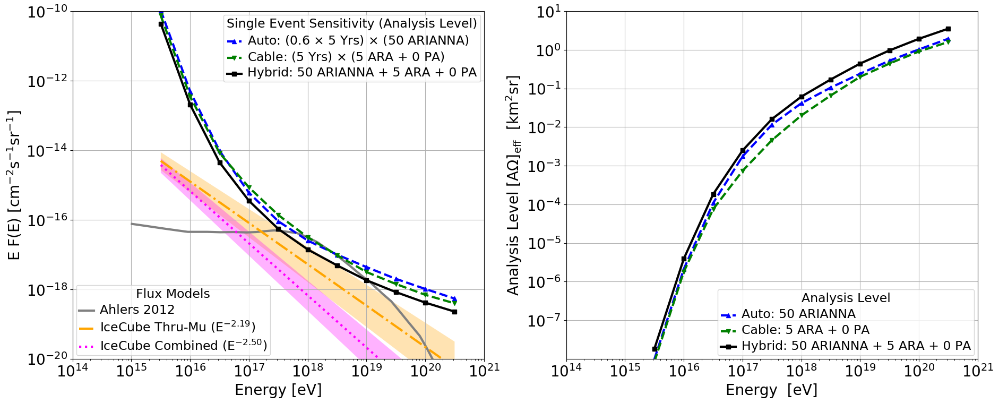

# comparison_plots
Python code to plot the current limits/effective areas for radio detectors
- Running `python plot_existing_limits.py` will plot the existing measured UHE neutrino sensitivities
- Running `python plot_hybrid.py` will plots estimates for what happens if you make hybrid detectors
- To change how the hybrid detectors are formed, alter the variables `num_ara`, `num_pa`, `num_arianna`, and `num_years` in the code.

# Example
Here's an example of what we can accomplish:
